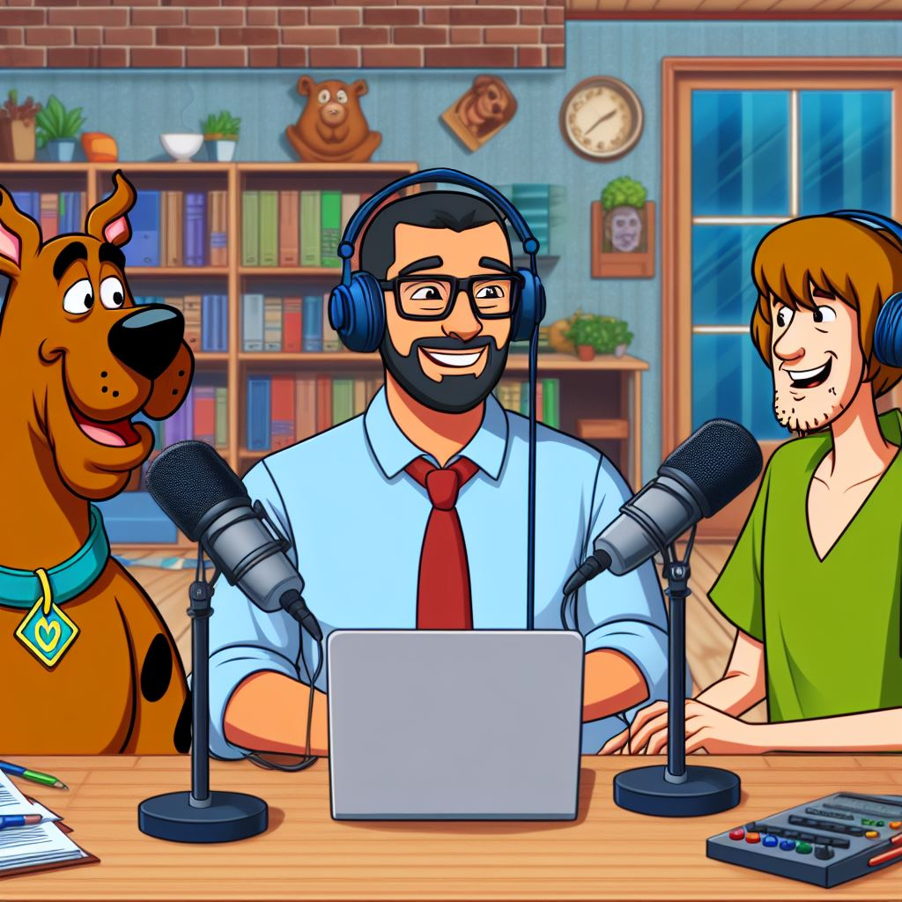

   

   
   

-------

    Preview do podcast - via vídeo

   <video controls title="Podcast ScoobyDoobyCode - vídeo">
      <source src="./output/podcast_ScoobyDoobyCode.mp4" type="video/mp4" />
      <a href="https://github.com/MarcosWinther/project-prompts-for-podcast-generate-by-ia/blob/main/output/podcast_ScoobyDoobyCode.mp4"> 🎬 Clique aqui para assistir!</a>
   </video>

-------

    Preview do podcast - via áudio

    <audio controls title="Podcast ScoobyDoobyCode - áudio">
      <source src="./output/podcast_ScoobyDoobyCode.mp3" type="audio/mpeg" />
     <a href="https://github.com/MarcosWinther/project-prompts-for-podcast-generate-by-ia/blob/main/output/podcast_ScoobyDoobyCode.mp3"> 🎧 Clique aqui para ouvir!</a>
    </audio>

-------
 

# 👨‍💻 Projeto artigo técnico gerado por I.A.s

 > ℹ️ **NOTE:** Este repositório é um desafio de projeto proposto no curso "Criando um Podcast com IAs Generativas" na plataforma da [DIO](https://dio.me).

Projeto proposto pelo expert Felipe Aguiar da plataforma DIO, com o objetivo de  de gerar um podcast utilizando ferramentas de IA através de prompts mais trabalhado.

Nesse projeto fiz um podcast chamado <b><i>"ScoobyDoobyCode: O Código do Mistério Revelado"</i></b>, o podcast que fala sobre o Mundo dos Desenvolvedores Front-End.

## 💻 Tecnologias utilizadas no projeto

- [ChatGPT](https://chat.openai.com/) 
- [Copilot Microsoft](https://copilot.microsoft.com/)
- [ElevenLabs](https://beta.elevenlabs.io/)
- [Capcut](https://www.capcut.com/pt-br/)

## 🧠 Prompts

ChatGPT：

|   Ação   | prompt                                                                                                                                                                                                                                                                         |
| :------: | ------------------------------------------------------------------------------------------------------------------------------------------------------------------------------------------------------------------------------------------------------------------------------ |
|  título  | Você é um roteirista de podcast e vamos criar um podcast de tecnologia, focado em front-end e eu gostaria de uma ajuda sua para criar 5 sugestões de nomes criativos para um podcast de front-end feito por nerds e que tenha algum trocadilho nerd sobre Scooby-Doo e Mistério S.A. no nome. O Podcast vai falar sobre dicas e novidades do mundo front end e o que está acontecendo no mercado, além de dicas de hard skills e soft skills para profissionais front end. {REGRAS} O nome deve ser enxuto, um nome e um subtítulo; A primeira palavra do título deve ser trocadilho e pequeno com o universo Scooby-Doo e programação web e depois do ':' deve ser seguido de outras palavras; O nome tenha algum trocadinho com nome ou falas dos personagens da franquia Scooby-Doo e Mistério S.A.; O nome deve conter alguma palavra forte que remeta a front end. {REGRAS NEGATIVAS} Não quero que o título contenha palavras em inglês; Não quero que utilize nenhuma das palavras nessa lista: JavaScript, programador, Angular; Não utilize a palavra front end no nome e nem qualuqer variação desta palavra.                                                        |
| conteúdo | Você é um roteirista de podcast, e vamos criar um  roteiro de um podcast de tecnologia, focado em frontend cujo o nome é "ScoobyDoobyCode:O Código do Mistério Revelado" e tem foco em frontend,  com o público alvo de iniciantes em frontend. O formato do roteiro deve ser: [INTRODUÇÃO][CURIOSIDADE 1][CURIOSIDADE 2][FINALIZAÇÃO]; {REGRAS} no bloco [INTRODUÇÃO] substitua por uma introdução iguais as introduções dos vídeos do canal 'ei nerd', como se fossem escritos pelo Peter Jordan; no bloco [CURIOSIDADE 1] substitua por uma curiosidade de hard skills e soft skills de um desenvolvedor front end; no bloco [CURIOSIDADE 2] sobre uma ferramenta para front ends; no bloco [FINALIZAÇÃO] substitua por uma despedida cool com o final 'Eu sou Marcos Winther e esse foi o ScoobyDoobyCode dessa semana'; use termos de fácil explicação; O podcast vai ser apresentado somente por uma pessoa, chamada Marcos Winther; O podcast deve ser curto; O podcast pode fazer analogias com o Universo Scooby-Doo. {REGRAS NEGATIVAS} Não use muitos termos técnicos; Não ultrapasse 5 minutos de duração. |

Copilot Microsot：

|  Ação  | prompt                                                                                 |
| :----: | -------------------------------------------------------------------------------------- |
| título | "Generate an image featuring Scooby-Doo and Shaggy equipped with microphones, hosting a podcast where they interview a technology professional. The scene should incorporate elements from the mystery-solving world of Mystery Inc. alongside references to programming and technology. Ensure the technology professional being interviewed is prominently featured in the scene." |

## ✨ Como foi feito ?

- Roteiro gerado via chatgpt
- Áudio gerado pela elevenLabs
- Copilot para gerar imagens
- Capcut para tratar aúdio e vídeo e adicionar sons de fundo

## 👨‍💻 Expert

   
   
&nbsp&nbsp&nbspMarcos Winther 
    &nbsp&nbsp&nbsp
    <a href="https://github.com/MarcosWinther">
    GitHub</a>&nbsp;|&nbsp;
    <a href="https://www.linkedin.com/in/marcoswinthersilva/">LinkedIn</a>
   

  

---

⌨️ com 💜 por [Marcos Winther](https://github.com/MarcosWinther)